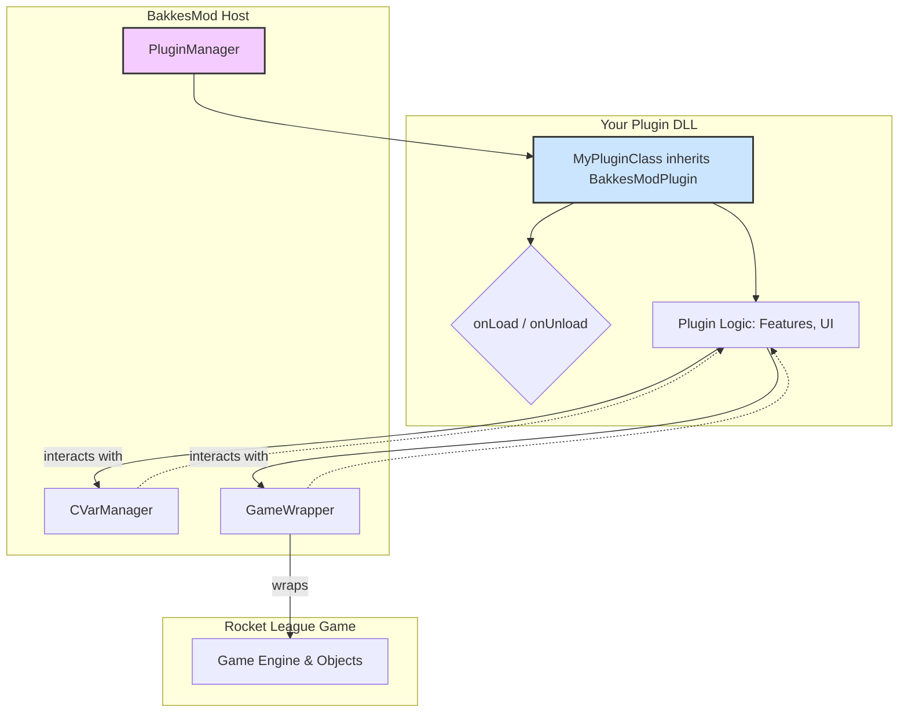

# BakkesMod Plugin Architecture

This document describes the high-level software architecture of a typical BakkesMod plugin. Understanding this architecture is key to knowing how to structure your code and where to find relevant functionalities.

## Core Components

A BakkesMod plugin is primarily composed of three layers:

1.  **The Plugin Host (BakkesMod):** This is the main BakkesMod application that loads and runs plugins. It manages the plugin lifecycle and provides the core APIs.
2.  **The Plugin DLL:** This is the C++ code you write, compiled into a `.dll` file. It contains the logic for your plugin's features.
3.  **The Game (Rocket League):** The underlying game that the plugin interacts with.

## Architectural Diagram

The following diagram illustrates the relationship between the key components of a plugin and the BakkesMod framework.

## Component Breakdown

### 1. Your Plugin (`MyPluginClass`)

-   This is the central class of your plugin, which you define.
-   It **must inherit** from `BakkesMod::Plugin::BakkesModPlugin`.
-   The `PluginManager` within BakkesMod discovers and loads this class.
-   It implements `onLoad()` as the main entry point to initialize the plugin and `onUnload()` to clean up resources.

### 2. BakkesMod Host

The host environment provides the essential services your plugin needs to operate.

#### `CVarManagerWrapper`

-   **Purpose:** Manages the console system.
-   **Accessed via:** The `cvarManager` member of your plugin class.
-   **Use Cases:**
    -   Registering console variables (`CVars`) to allow users to configure your plugin.
    -   Registering `notifiers`, which are commands that can be executed from the console.
    -   Executing console commands.

#### `GameWrapper`

-   **Purpose:** The primary gateway for interacting with the game world.
-   **Accessed via:** The `gameWrapper` member of your plugin class.
-   **Use Cases:**
    -   Accessing and manipulating game objects (like cars, the ball, and the game server) through other specialized wrappers (`CarWrapper`, `BallWrapper`, `ServerWrapper`).
    -   Hooking into game events (e.g., `Function:TAGame.Ball_TA.OnHitGoal`).
    -   Checking the game state (e.g., `IsInFreeplay()`, `IsInOnlineGame()`).
    -   Registering custom rendering functions to draw on the screen (`RegisterDrawable`).

### 3. Game Object Wrappers

-   **Purpose:** To provide a safe and stable way to interact with Unreal Engine objects from the game. Direct memory manipulation is unsafe because game updates can change memory layouts. Wrappers solve this problem.
-   **Examples:** `CarWrapper`, `BallWrapper`, `ServerWrapper`, `PlayerControllerWrapper`.
-   **How it works:** `GameWrapper` provides functions to get instances of these wrappers (e.g., `gameWrapper->GetLocalCar()`). You then use the functions on the wrapper object to interact with the game object (e.g., `localCar.SetCarRotation(newRotator)`).

This architecture allows your plugin logic to remain separate from the core BakkesMod host and the game itself, interacting only through the provided, stable API wrappers.
